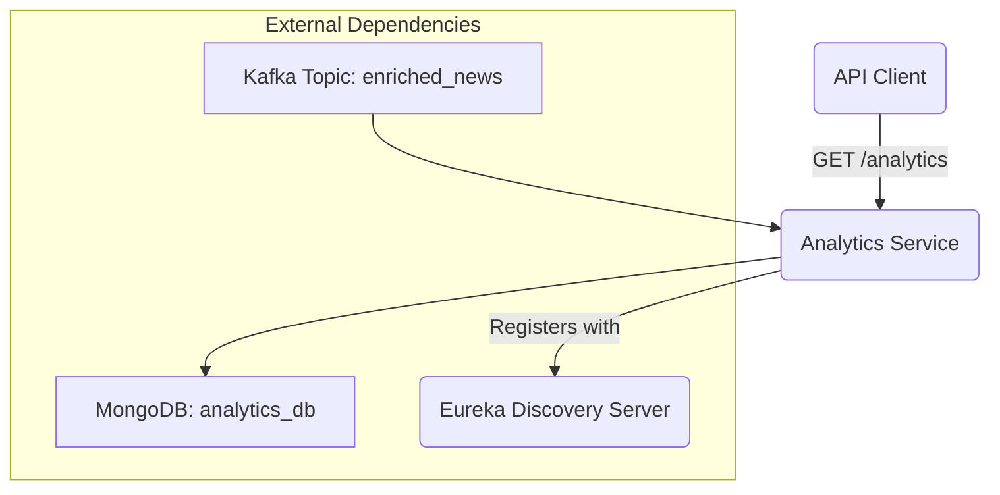

# Analytics Service

This service is responsible for collecting, storing, and exposing analytics events generated within the News Recommendation microservice ecosystem. It is built with NestJS.

## Architecture

The service operates by consuming events from a Kafka topic, processing them, and persisting them into a MongoDB database. It also registers itself with the Eureka server for discovery by other services like the API Gateway.



## Getting Started

Follow these instructions to get the analytics service up and running on your local machine for development and testing purposes.

### Prerequisites

Before you begin, ensure you have the following installed and running:

- **Node.js & npm**: [Download & Install Node.js](https://nodejs.org/)
- **MongoDB**: The service is configured to connect to `mongodb://localhost:27017/analytics`.
- **Apache Kafka**: The service expects a broker at `localhost:29092`.
- **Eureka Server**: The service attempts to register with a Eureka server at `http://localhost:8901/eureka/`.

### Installation

1.  Navigate to the service directory:
    ```bash
    cd back/analytics-service
    ```

2.  Install the dependencies:
    ```bash
    npm install
    ```

### Running the Service

1.  Start the development server:
    ```bash
    npm run start
    ```

2.  The service will be running on `http://localhost:3006`.

## API Endpoints

### Get All Analytics Events

-   **GET** `/analytics`
-   **Description**: Retrieves all analytics events that have been stored in the database.
-   **Response**: `200 OK`
    ```json
    [
      {
        "_id": "63f8c6b9b9b9b9b9b9b9b9b9",
        "eventId": "unique-event-id-123",
        "eventType": "USER_ENGAGEMENT",
        "timestamp": "2025-12-26T12:00:00.000Z",
        "engagement": {
          "userId": "user-abc",
          "resourceId": "news-article-456",
          "action": "VIEW",
          "durationSeconds": 60
        },
        "createdAt": "2025-12-26T14:30:00.000Z",
        "updatedAt": "2025-12-26T14:30:00.000Z"
      }
    ]
    ```